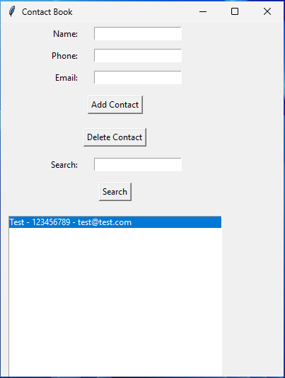

# Contact Book

A simple Contact Book application built with Python and Tkinter.

## Features

- Add new contacts with name, phone number, and email.
- Delete existing contacts.
- Search for contacts by name, phone number, or email.
- Save contacts to a JSON file for persistent storage.
- Load contacts from a JSON file on startup.

## Usage

- Enter the contact details (Name, Phone, Email) in the respective fields.
- Click "Add Contact" to save the contact.
- Select a contact from the list and click "Delete Contact" to remove it.
- Use the search box to find contacts by name, phone number, or email.

### Download the Pre-built Version

You can download the finished program as a zip file

## Support

If you find this project helpful, consider supporting me on [Buy Me a Coffee](https://www.buymeacoffee.com/cyberxcyborg).

